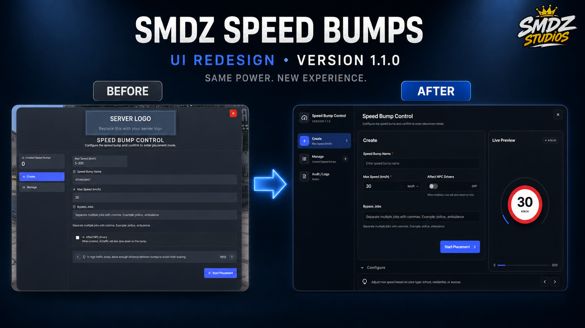

 

    
  

---

#  1.1.0 🎟️ | SMDZ Invite Codes - 2026-08-21

### ✅ ADDED:

- Added mandatory `smdz_bridge` dependency.
- Added automatic bridge health checks and required module validation during resource startup.
- Added detailed debug prints for bridge providers, reward delivery, inventory operations, and code redemptions.
- Added translated debug messages for all supported languages.
- Added Dutch (`nl`) language support.

### 🔧 CHANGED:

- The ASCII banner on the startup console has been updated and scaled down so it's not as distracting; furthermore, this practice will be applied to current and future scripts.
- Framework operations are now handled through `smdz_bridge`.
- Inventory operations are now handled exclusively through `smdz_bridge`.
- TextUI is now handled exclusively through `smdz_bridge`.
- Notifications are now handled exclusively through `smdz_bridge`.
- Removed direct integrations with individual framework, inventory, TextUI, and notification resources.
- Removed the legacy custom notification configuration.
- Target integration remains local with support for `ox_target` and `qb-target`.
- Improved startup validation when `smdz_bridge` is missing, unavailable, or not ready.
- Improved reward delivery validation and inventory error handling.

### 🧩 FIXED:

- Fixed item rewards incorrectly reporting insufficient inventory space even when the player's inventory was empty.
- Fixed `CanCarryItem` potentially blocking valid reward redemptions on some inventory providers.
- Reward capacity checks are now diagnostic only, while `AddItem` is used as the authoritative delivery result.
- Fixed inconsistent reward delivery behavior between different inventory providers.
- Fixed bridge and reward delivery errors being difficult to diagnose by adding more detailed debug information.
- Minor fixes to the process of handing out money via code.
- Improved optimization for loading multiple NPCs generated by this script.

### 🗂️ FILES MODIFIED:

**Starting with SMDZ Invite Codes `1.1.0`, the latest version of `smdz_bridge` is required. SMDZ Bridge is completely free and available from the SMDZ Studios store.**

- `fxmanifest.lua`
- `config.lua`
- `client/*`
- `server/*`
- `locales/*`

---

#  1.0.1 📞 | SMDZ Witness Calls - 2026-08-20

### ✅ ADDED:

- Added full dispatch integration through the `smdz_bridge` resource.
- Added mandatory `smdz_bridge` dependency.
- Added automatic validation of the `dispatch.send` bridge module.
- Added readable weapon names when sending firearm-related witness reports.
- Added fallback weapon name handling for supported GTA V weapons.

### 🔧 CHANGED:

- Dispatch notifications are now handled exclusively through `smdz_bridge`.
- Removed direct dependency on individual dispatch resources.
- Improved the structure of dispatch payloads sent by witness reports.
- Improved dispatch metadata filtering to only send relevant information.
- Improved compatibility with different dispatch systems supported by `smdz_bridge`.
- Improved dispatch availability checks when the configured dispatch provider is restarted or becomes unavailable.

### 🧩 FIXED:

- Fixed internal script keys such as `crimeType`, `detection`, `suspectGender`, and other internal values appearing inside dispatch notifications.
- Fixed weapon hashes such as `453432689` appearing instead of readable weapon names in some cases.
- Fixed unnecessary internal metadata being included in civilian reports.
- Fixed dispatch reports displaying incorrectly formatted crime information in some cases.
- Fixed potential issues when the active dispatch provider is restarted while Witness Calls is running.

### 🗂️ FILES MODIFIED:

**This update requires the latest version of `smdz_bridge`. The dispatch module is now mandatory for SMDZ Witness Calls.**

- `fxmanifest.lua`
- `config.lua`
- `client/*`
- `server/*`
- `bridge/*`

---

#  1.1.0 🚧 | SMDZ Speed Bumps - 2026-08-15

  

### ✅ ADDED:

- Added a completely redesigned administration interface for creating and managing speed bumps.
- Added a new **Audit / Logs** section to track administrative actions such as creating, editing, deleting, cloning, and repositioning speed bumps.
- Added search and pagination support to Audit Logs.
- Added automatic SQL setup and migration on resource startup, including missing tables, columns, and indexes.
- Added a server-side 15-second cooldown to the Refresh action, with the remaining cooldown displayed directly in the UI.
- Added runtime UI color customization through `config_ui.lua` without requiring the interface to be rebuilt.
- Added four new languages: Italian, Portuguese, Dutch, and Polish, bringing the resource to **8 supported languages**.

### 🔧 CHANGED:

- Completely redesigned the sidebar, navigation, forms, cards, buttons, pagination, scrollbars, and general interface layout.
- Increased the overall interface and text size for improved readability.
- Improved the speed limit preview with a European-style red speed restriction sign.
- Manage now displays **6 speed bumps per page**.
- Improved the placement interface with larger and centered coordinates and title information.
- Removed the Local/World Gizmo control from the placement interface.
- Improved visual feedback, page title animations, SVG icon usage, hover effects, and transitions.
- Moved Discord webhook configuration to `server_config.lua` so webhook URLs remain server-side.
- Moved configuration files from the previous `shared` folder to the resource root.
- The detection of NPCS vehicles when passing through a speed limiter has been improved; further improvements will be made in the future, and currently, some detection problems may still occur in certain cases.

### 🧩 FIXED:

- Fixed the speed limit sign not appearing correctly inside the Live Preview of the beta version.
- Fixed native CEF/Chromium focus outlines appearing around sidebar items, buttons, cards, inputs, and other interactive elements.
- Fixed several inconsistent button and focus states across the interface of the beta version.
- Fixed the NUI displaying a dark background when opening or closing of the beta version.
- Fixed various spacing, alignment, sizing, and visual consistency issues throughout the UI of the beta version.
- Minor bugs fixed around the bridge.
- Client synchronization bugs fixed and tested.

### 🗂️ FILES MODIFIED:

**Existing installations no longer require manually importing SQL changes. The resource will automatically create or update the required database structure on startup.**

- `fxmanifest.lua`
- `config.lua`
- `config_ui.lua`
- `server_config.lua`
- `server/*`
- `locales/*`
- `web/src/*`
- `web/dist/assets/*`
- `smdz_speed_bumps.sql`

---

#  1.1.0 🚕 | SMDZ SmartCab - 2026-08-04
### ✅ ADDED:

- Added optional vehicle keys compatibility through the free and open-source `community_bridge` resource.
- Added the new `Config.KeysCompatibility` option.
- Players now receive the taxi keys when the vehicle arrives at the pickup location.
- Taxi keys are automatically removed when the service is completed, cancelled, or cleaned up.
- Added automatic cleanup of all vehicles created by SmartCab when the resource is stopped.
- Added dedicated vehicle keys integration logic through `client/keys.lua`.

### 🔧 CHANGED:

- Improved the passenger boarding process on servers using vehicle key systems.
- Improved taxi driving AI, route navigation, stopping behavior, and obstacle handling.
- Improved the taxi approach behavior at pickup and destination locations.
- Added minor visual improvements to the SmartCab interface.
- Improved UI spacing, transitions, and general visual consistency.

### 🧩 FIXED:

- Fixed an issue where players received the taxi keys but were unable to enter the vehicle.
- Fixed the passenger entry animation being cancelled before entering the taxi.
- Fixed external key systems automatically locking taxis driven by NPCs.
- Fixed taxi keys not always being removed after finishing or cancelling a service.
- Fixed SmartCab vehicles remaining active after stopping the resource.
- Fixed several situations where the driving AI could become stuck or stop incorrectly.

### 🗂️ FILES MODIFIED:

**It is HIGHLY RECOMMENDED to install this update on servers using a vehicle keys or automatic locking system.**

- `fxmanifest.lua`
- `config.lua`
- `client/service.lua`
- `client/keys.lua`
- `server/cleanup.lua`
- `web/src/*`
- `web/dist/assets/*`

---

#  1.1.0 🚗 | Handling Editor - 2026-07-13
### ✅ ADDED:

- Added real-time vehicle handling synchronization between all players.
- Handling changes now remain active after leaving the vehicle and until the vehicle is removed.
- Players entering an edited vehicle will automatically receive the same handling settings.
- The editor now displays the latest synchronized values when opened by another player.
- Added live synchronization when multiple players are editing the same vehicle.
- Added support for driving the vehicle while the handling editor is open.

### 🔧 CHANGED:

- Improved the way handling values are applied to make changes more noticeable and reliable.
- The editor now verifies the real value applied to the vehicle before updating the interface.
- Improved top speed updates so vehicle speed changes take effect correctly.
- Improved presets and reset functionality for more consistent results.
- Improved synchronization stability to prevent older changes from replacing newer ones.
- Driving controls now remain available while testing and adjusting the vehicle.

### ❌ REMOVED:

- Removed outdated synchronization and activation logic.

### ⚠️ UPDATE NOTE:

- **It is HIGHLY RECOMMENDED to install the update for servers that had version 1.0.0 at launch.**

### 🗂️ FILES MODIFIED:

- `fxmanifest.lua`
- `client/main.lua`
- `server/main.lua`
- `web/src/App.jsx`
- `web/dist/assets/app-*.js`

---

#  1.1.0 🚌 | Bus Travels - 2026-06-20
### ✅ ADDED:

- Added additional waiting scenarios to `Config.WaitAnims` for more varied and natural NPC behavior.

### 🔧 CHANGED:

- With the release of version `1.1.0`, the script’s price has been permanently reduced from **€16.99** to **€9.99**, excluding taxes. (escrow version)
- This is a permanent price adjustment and not a limited-time discount.
- Updated the server startup banner to display the currently selected or automatically detected:

  - Framework
  - Inventory
  - Progress bar
  - Notification system
  - Locale

- Moved the locale core from `shared/locale.lua` to `init/locale.lua` for improved organization and initialization.
- Moved webhook configuration exclusively to `server/server_config.lua`.

### 🧩 FIXED:

- Fixed several client-side synchronization issues that could cause inconsistent behavior between players.
- Removed duplicate locale keys found in several supported languages.
- Fixed the server startup thread to call `printStartupBanner()` directly.

### ❌ REMOVED:

- **The use of Xbox Live IDs has been completely eliminated to comply with the [new CFX changes](https://forum.cfx.re/t/deprecation-notice-xbox-live-and-microsoft-player-identifiers/5397645/1).**
- Removed `Config.Webhooks` from the shared configuration to prevent webhook URLs from being exposed client-side.

### 🗂️ FILES MODIFIED:

- `fxmanifest.lua`
- `init/locale.lua`
- `server/server_config.lua`
- `shared/config.lua`
- `server/sv_main.lua`
- `client/cl_main.lua`
---

#  1.2.0 🐄 | The Rancher Job - 2026-05-22
### ✅ ADDED:
- New global anti-exploit toggle `Config.AntiExploit.enabled`.
- Shared anti-exploit state helper in client and server to keep behavior consistent.
- Added `@ox_lib/init.lua` to `shared_scripts` in `fxmanifest.lua`.
- Added `dependency 'ox_lib'` in `fxmanifest.lua`.
- Added inventory bridge support for `ak47_inventory` (`AddItem` export integration).

### 🔧 CHANGED:
- Fixed job finish validation so active jobs are no longer blocked with `expired_job` while already in progress.
- Anti-exploit checks now fully respect `Config.AntiExploit.enabled` across start/finish flow.
- Improved finish delivery validation to reduce false `notify_job_invalid_delivery` caused by temporary server-side herd desync at delivery time.

### ❌ REMOVED:
- Removed `Config.AntiExploit.maxFinishAttempts` from `shared/config.lua`.
- Removed all server-side `maxFinishAttempts` / `finishAttempts` spam-cancel logic.

### 🗂️ FILES MODIFIED:
- `bridge/inventory.lua`
- `client/main.lua`
- `server/main.lua`
- `shared/config.lua`
- `fxmanifest.lua`

---

## 1.3.0 🔖 | Evidence Markers - 2026-04-21
### ✅ ADDED:
- Marker info interaction on active markers through target.
- Marker info now opens using the same existing evidence NUI card in read-only mode.
- New config block `Config.Target.Info`.
- New config block `Config.Timezone`.
- Server-side anti-spam and validation for marker info requests.
- Minor improvements to increase optimization.

### 🔧 CHANGED:
- Updated default place/pickup animations in `config.lua`:
  - `dict = 'random@domestic'`
  - `name = 'pickup_low'`
- Banner framework display now correctly reads `Config.Framework.Mode` (fixed `table: 0x...` output).
- Webhook identity now uses `Config.Webhook.Identity` consistently (`Username`, `Avatar`).

### ❌ REMOVED:
- **The use of Xbox Live IDs has been completely eliminated to comply with the [new CFX changes](https://forum.cfx.re/t/deprecation-notice-xbox-live-and-microsoft-player-identifiers/5397645/1).**
- Legacy compatibility bootstrap code from the bottom of `config.lua`.

### 🗂️ FILES MODIFIED:
- `bridge/framework.lua`
- `bridge/notify.lua`
- `bridge/targets.lua`
- `client/cl_edit_props.lua`
- `client/cl_exports.lua`
- `client/cl_main.lua`
- `config.lua`
- `locales/en.lua`
- `locales/es.lua`
- `nui/app.js`
- `nui/index.html`
- `nui/style.css`
- `server/sv_main.lua`

---

## 1.1.0 🐄 | The Rancher Job - 2026-04-21
### ✅ ADDED:

- Added NPC distance-based streaming on client side:
  - NPC and job blip are created only when the player is within `200.0` meters.
  - NPC and job blip are cleaned up when the player is farther than `200.0` meters.
- Added cow distance culling on server side:
  - Spawned cow entities now use `SetEntityDistanceCullingRadius(..., 200.0)`.
  - Players farther than `200.0` meters do not stream/render those cows.

### 🧩 FIXED:

- Prevented global job expiration/rotation while a player is actively running the ranch job (`currentJob.activeBy`).
- This stops the NPC/job point from changing mid-run and avoids herd loss caused by forced job resets.

### ❌ REMOVED:

- **The use of Xbox Live IDs has been completely eliminated to comply with the [new CFX changes](https://forum.cfx.re/t/deprecation-notice-xbox-live-and-microsoft-player-identifiers/5397645/1).**

### 🗂️ FILES MODIFIED:
- `client/main.lua`
- `server/main.lua`
- `shared/config.lua`
---

## 1.2.0 🔖 | Evidence Markers - 2026-04-03
### 🧩 FIXED:
- A bug has been fixed for ox inventory which was blocking the purchase and drag from an ox inventory store to the inventory.

### 🗂️ FILES MODIFIED:
- `server/sv_exports.lua`

---

## 1.1.0 📱 | LB APP Emergency Alerts - 2026-03-23
### ✅ ADDED:
- Support for ACE permissions has been added to the administrative command to delete alerts. (ACE or GROUPS permissions)
- Docs updated.

### 🧩 FIXED:
- An SQL error regarding player settings has been fixed.

---

## 1.1.0 🎨 | OX Target Crystal Style - 2026-03-13
### ✅ ADDED:
- Added ACE permission support for restricted themes in `Config.ThemeDonator` and `Config.ThemeDiscordBoosters`:
  - New `AcePermissions` option (for example: `group.admin`, `admin`, `themediscordboosters`).
- Added server callback `ox_target:hasAcePermission` for client-side ACE checks.
- Added real `server.cfg` / `permissions.cfg` usage examples in `config.lua`.
- Two new languages ​​have been added to the locale. (nl.lua and tr.lua)

### 🔧 CHANGED:
- Updated theme lock checks in `client/main.lua` to grant access using OR logic:
  - `Groups` **or*- `AcePermissions`.
  - Neither one overrides the other.
- Strengthened server-side permission validation:
  - Supports both `admin` and `group.admin` formats.
  - Uses `qbx_core:HasPermission` when available, with `IsPlayerAceAllowed` fallback.
- Improved QBX framework group checks in `client/framework/qbx.lua`:
  - Fixed `QBX:HasGroup` filter usage.
  - Added compatibility for multi-job/multi-gang group structures.
  - Added permission caching to reduce repeated callback calls.
- Updated `config.lua` comments with clearer real-world examples.

### 🧩 FIXED:
- Improved QBCore group compatibility in `client/framework/qb.lua`:
  - Safer `PlayerData` fallback handling.
  - Grade parsing compatibility for `number`, `string`, and `table` formats.
  - More robust group/permission matching (including `group.<perm>` patterns).
  - Prevented invalid comparisons when hash filters include non-numeric grade values.

### 🗂️ FILES MODIFIED:
- `config.lua`
- `client/main.lua`
- `server/main.lua`
- `client/framework/qbx.lua`
- `client/framework/qb.lua`

---

## 1.1.0 📡 | Emergency GPS - 2026-03-02
### ✅ ADDED:
- Added favorite color support with SQL persistence (same behavior as icon favorites).
- Added 3 new UI themes: Obsidian, Lagoon, Saffron.
- Added a Config reset button to clear last label/icon/color/scale for the player.

### 🔧 CHANGED:
- Remember and persist last label, icon, color, and scale between NUI openings.
- Blocks game inputs while typing in the NUI to prevent keybind conflicts.
- Favorites tab label title now shows correctly above the label input.
- UI now displays the Quick Reset title/description/button texts (reset block localized).
- Favorited color indicators now show the golden star, same as icon favorites.
- Cleaned locales and UI strings to match the new feature set.
- Persist last label/icon/color/scale in SQL (shared across devices).

### 🧩 FIXED:
- Fixed duplicate vehicle refs when driver and copilot create refs on the same vehicle (now single ref per vehicle netId).
- Resmon optimization adjustments applied.

### ❌ REMOVED:
- Removed all management ping functionality (UI, events, permissions, locales and webhooks).

### 🗂️ FILES MODIFIED:
- `client/cl_client.lua`
- `server/sv_server.lua`
- `html/app.js`
- `html/index.html`
- `html/style.css`
- `bridge/database.lua`
- `sql/database.sql`
- `locales/en.lua`
- `locales/es.lua`
- `locales/fr.lua`
- `locales/pt.lua`
- `locales/de.lua`

---

## 1.1.1 🔖 | Evidence Markers - 2026-02-20
- The `client/cl_edit_props.lua` file is now open source to avoid `"syntax error near '<\1>'"` problems.
- The `INSTALL_FILES/items_tgiann-inventory.lua` file has been added for convenience when adding objects to this inventory.
**NOTE: This update is not required for current customers.**

---

## 1.1.0 🔖 | Evidence Markers - 2026-02-14
### ✅ ADDED:

- Added compatibility layer in `config.lua` to map new structured config to legacy fields used by runtime.
- Added client and server exports `useItem` and declared them in `fxmanifest.lua`.
- Added `Config.DrawText3D.RenderDistance` to limit drawtext rendering distance for lower CPU usage.
- Added `Config.DrawText3D.ScanInterval` and cached nearby markers to reduce per-frame drawtext cost.
- Added `Config.DrawText3D.IdleWait` to lower drawtext loop frequency when no markers are nearby.

### 🔧 CHANGED:

- Updated server logic to support marker definitions under `Config.Markers.Items` and safe ox_inventory export handling.
- Updated ox_inventory item definitions to call `smdz_evidence_markers.useItem` via server export.
- Updated QS inventory item definitions with usable fields (`name`, `type`, `unique`, `useable`, `shouldClose`).
- Moved exports into `client/cl_exports.lua` and `server/sv_exports.lua` and added additional utility exports.

### 🧩 FIXED:

- Fixed ox_inventory export signature handling so items can be used reliably.
- Now the debug mode is displayed correctly; previously, even when activated, it was not shown.

### ❌ REMOVED:

- Removed all `lj-inventory` support from the inventory bridge.

### 🗂️ FILES MODIFIED:

- `config.lua` (You need to replace the old config.lua with the new one)
- `fxmanifest.lua`
- `bridge/inventory.lua`
- `client/cl_main.lua`
- `client/cl_exports.lua`
- `server/sv_main.lua`
- `server/sv_exports.lua`
- `INSTALL_FILES/items_ox_inventory.lua`
- `INSTALL_FILES/items_qs_inventory.lua`
