

  

    
  

  <h1 class="hero-main-title">
    PORTAL | OFFICIAL DOCUMENTATION
  </h1>
  

    <a class="hero-quick-link hero-quick-link--store" href="https://smdz-studios.tebex.io/" target="_blank" rel="noopener noreferrer">
      <svg viewBox="0 0 24 24" aria-hidden="true" focusable="false">
        <path d="M3 4.75A1.75 1.75 0 0 1 4.75 3h14.5A1.75 1.75 0 0 1 21 4.75v1.5A3.75 3.75 0 0 1 17.25 10H17v8.25A1.75 1.75 0 0 1 15.25 20h-6.5A1.75 1.75 0 0 1 7 18.25V10h-.25A3.75 3.75 0 0 1 3 6.25v-1.5Zm5.5 5.25v8h7V10h-7Zm-4-3.75v.5A2.25 2.25 0 0 0 6.75 9H7V4.5h-2.25A.25.25 0 0 0 4.5 4.75v1.5Zm4 0V9h7V6.25h-7Zm8.5 0V9h.25a2.25 2.25 0 0 0 2.25-2.25v-1.5a.25.25 0 0 0-.25-.25H17v1.25Z"></path>
      </svg>
      STORE
    </a>
    <a class="hero-quick-link hero-quick-link--support" href="https://discord.gg/tA43awBqAN" target="_blank" rel="noopener noreferrer">
      <svg viewBox="0 0 24 24" aria-hidden="true" focusable="false">
        <path d="M20.317 4.369A19.791 19.791 0 0 0 15.885 3c-.191.328-.404.769-.554 1.115a18.273 18.273 0 0 0-5.487 0A11.64 11.64 0 0 0 9.29 3a19.736 19.736 0 0 0-4.434 1.372C2.052 8.579 1.29 12.682 1.669 16.728a19.924 19.924 0 0 0 5.427 2.735c.44-.602.832-1.236 1.167-1.907a12.955 12.955 0 0 1-1.83-.871c.154-.113.305-.23.451-.351 3.53 1.658 7.368 1.658 10.855 0 .149.121.3.238.451.351-.585.34-1.197.631-1.83.871.335.671.727 1.305 1.167 1.907a19.908 19.908 0 0 0 5.429-2.737c.444-4.7-.76-8.766-3.51-12.357ZM8.02 14.248c-1.055 0-1.92-.968-1.92-2.16 0-1.192.848-2.16 1.92-2.16 1.08 0 1.936.978 1.92 2.16 0 1.192-.849 2.16-1.92 2.16Zm7.96 0c-1.056 0-1.92-.968-1.92-2.16 0-1.192.848-2.16 1.92-2.16 1.08 0 1.936.978 1.92 2.16 0 1.192-.849 2.16-1.92 2.16Z"></path>
      </svg>
      SUPPORT
    </a>
  

  <button class="portal-filter-btn is-active" type="button" data-filter="all">All</button>
  <button class="portal-filter-btn" type="button" data-filter="open-source">Open Source</button>
  <button class="portal-filter-btn" type="button" data-filter="esx">ESX</button>
  <button class="portal-filter-btn" type="button" data-filter="qbcore">QBCore</button>
  <button class="portal-filter-btn" type="button" data-filter="standalone">Standalone</button>
  <button class="portal-filter-btn" type="button" data-filter="redesign">Redesigns</button>

  <article class="home-showcase-card">
    

      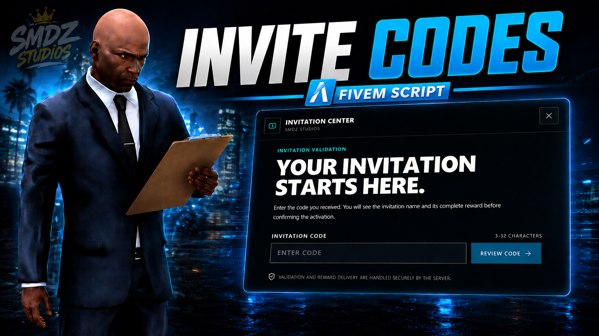
    

    

      <h3>Invite Codes</h3>
      
SMDZ Invite Codes is a polished invitation and promotional code system for FiveM. Players can redeem configurable rewards through streamed NPCs, while authorized staff can create, edit, pause, monitor, and manage every code from a complete in-game administration panel

      

        STANDALONEESXQBCOREQBXOPEN SOURCE AVAILABLE
      

      

        <a class="home-showcase-btn home-showcase-btn--docs" href="/#/resources/paid/invite-codes.md">VIEW DOCS</a>
        <a class="home-showcase-btn home-showcase-btn--buy" href="https://smdz-studios.tebex.io/package/invite-codes" target="_blank" rel="noopener noreferrer">BUY NOW</a>
      

    

  </article>

  <article class="home-showcase-card">
    

      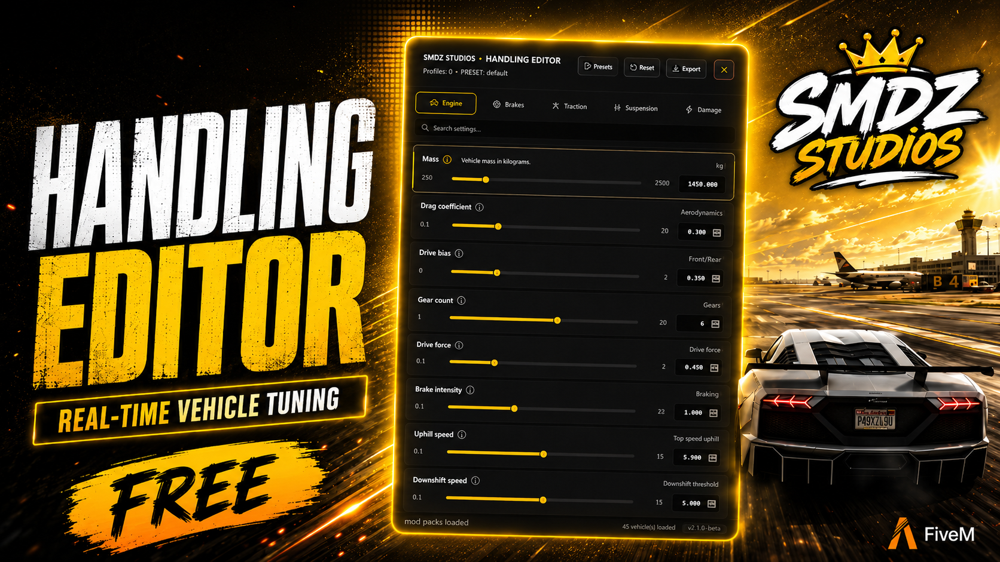
    

    

      <h3>Handling Editor</h3>
      
SMDZ Handling Editor is a real-time vehicle tuning tool for FiveM. Edit handling values directly in-game, test changes instantly, save presets, restore original values, and export ready-to-use XML for your handling.meta file.

      

        STANDALONEFREEOPEN SOURCE AVAILABLE
      

      

        <a class="home-showcase-btn home-showcase-btn--docs" href="/#/resources/free/handling-editor.md">VIEW DOCS</a>
        <a class="home-showcase-btn home-showcase-btn--buy" href="https://smdz-studios.tebex.io/package/handling-editor" target="_blank" rel="noopener noreferrer">BUY NOW</a>
      

    

  </article>

  <article class="home-showcase-card">
    

      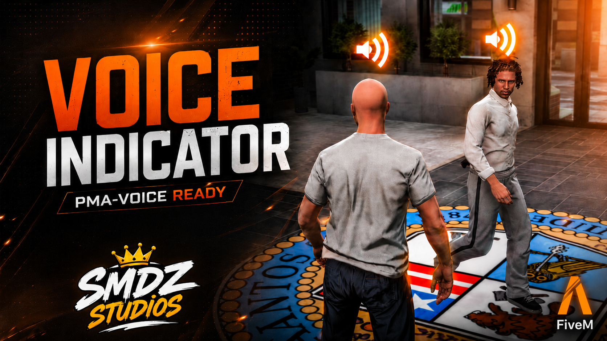
    

    

      <h3>Voice Indicator</h3>
      
SMDZ Voice Indicator is a modern voice activity system for FiveM, designed to make player communication clearer, more immersive, and easier to understand during roleplay. It displays customizable indicators above nearby players while they speak, with dedicated visual states for proximity voice, radio transmissions, and phone calls.

      

        STANDALONEESXQBCOREQBX
      

      

        <a class="home-showcase-btn home-showcase-btn--docs" href="/#/resources/paid/voice-indicator.md">VIEW DOCS</a>
        <a class="home-showcase-btn home-showcase-btn--buy" href="https://smdz-studios.tebex.io/package/7523221" target="_blank" rel="noopener noreferrer">BUY NOW</a>
      

    

  </article>

  <article class="home-showcase-card">
    

      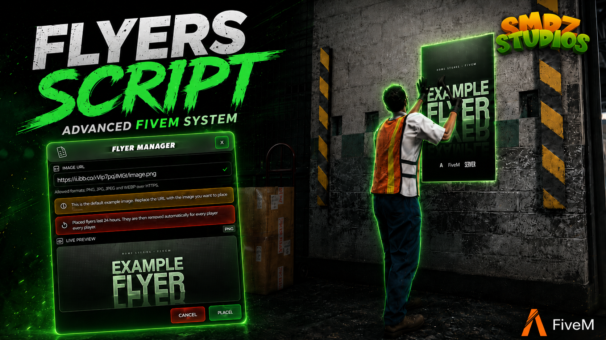
    

    

      <h3>Flyers</h3>
      
SMDZ Flyers is an advanced flyer placement and advertising system for FiveM, designed to help roleplay servers bring businesses, events, job opportunities, and community announcements directly into the game world. It provides players with a clean and immersive way to create, preview, place, and interact with persistent flyers across Los Santos.

      

        STANDALONEESXQBCOREQBX
      

      

        <a class="home-showcase-btn home-showcase-btn--docs" href="/#/resources/paid/flyers.md">VIEW DOCS</a>
        <a class="home-showcase-btn home-showcase-btn--buy" href="https://smdz-studios.tebex.io/package/7512981" target="_blank" rel="noopener noreferrer">BUY NOW</a>
      

    

  </article>

  <article class="home-showcase-card">
    

      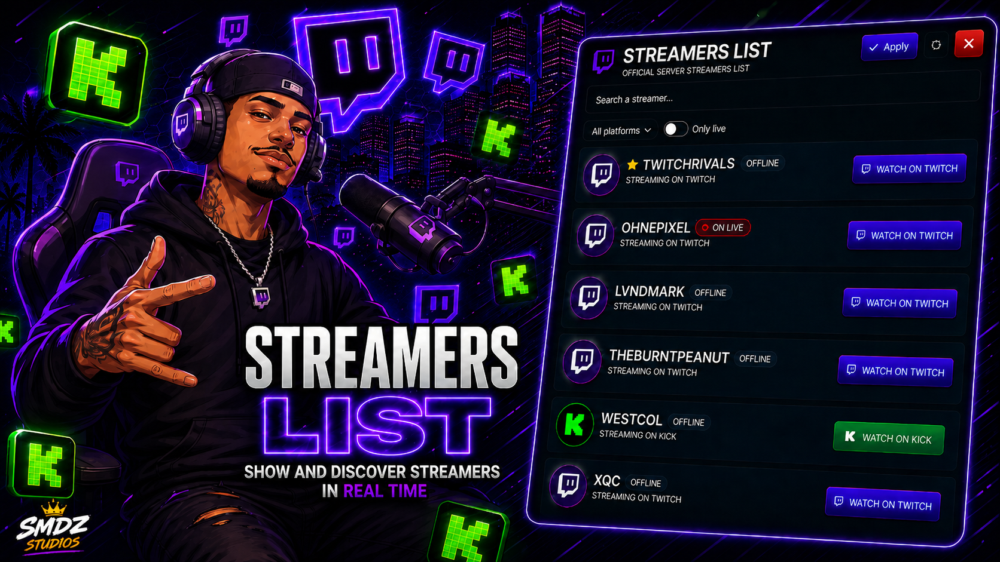
    

    

      <h3>Streamers List</h3>
      
Advanced streamer list system with a modern NUI, secure streamer applications, real-time staff panel, SQL persistence, and Twitch/Kick live checks handled server-side.

      

        STANDALONEESXQBCOREQBX
      

      

        <a class="home-showcase-btn home-showcase-btn--docs" href="/#/resources/paid/streamers-list.md">VIEW DOCS</a>
        <a class="home-showcase-btn home-showcase-btn--buy" href="https://smdz-studios.tebex.io/package/7495147" target="_blank" rel="noopener noreferrer">BUY NOW</a>
      

    

  </article>

  <article class="home-showcase-card">
    

      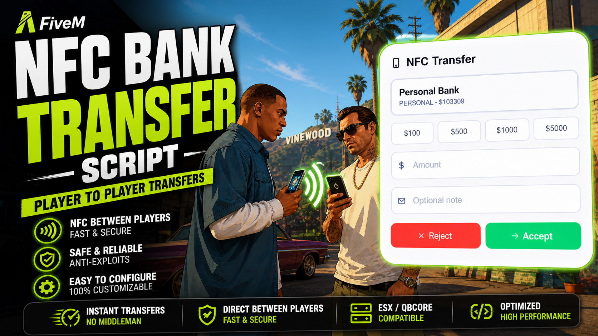
    

    

      <h3>NFC Transfers</h3>
      
High-end NFC money transfer system with secure server-side validation, React NUI, account-aware banking bridges, optional history/NPC interaction, and broad compatibility with ESX/QB ecosystems.

      

        ESXQBCOREQBXOPEN SOURCE AVAILABLE
      

      

        <a class="home-showcase-btn home-showcase-btn--docs" href="/#/resources/paid/nfc-transfer.md">VIEW DOCS</a>
        <a class="home-showcase-btn home-showcase-btn--buy" href="https://smdz-studios.tebex.io/package/nfc-transfers" target="_blank" rel="noopener noreferrer">BUY NOW</a>
      

    

  </article>

  <article class="home-showcase-card">
    

      
    

    

      <h3>iFruit Pods APP</h3>
      
A production-ready LB Phone app designed to control wireless pods, featuring secure audio playback, advanced playlist management, queue & repeat systems, persistent settings (including dark mode), and asynchronous webhook logging.

      

        ESXQBCOREQBXOPEN SOURCE AVAILABLE
      

      

        <a class="home-showcase-btn home-showcase-btn--docs" href="/#/resources/paid/ifruit-pods.md">VIEW DOCS</a>
        <a class="home-showcase-btn home-showcase-btn--buy" href="https://smdz-studios.tebex.io/package/7432166" target="_blank" rel="noopener noreferrer">BUY NOW</a>
      

    

  </article>

  <article class="home-showcase-card">
    

      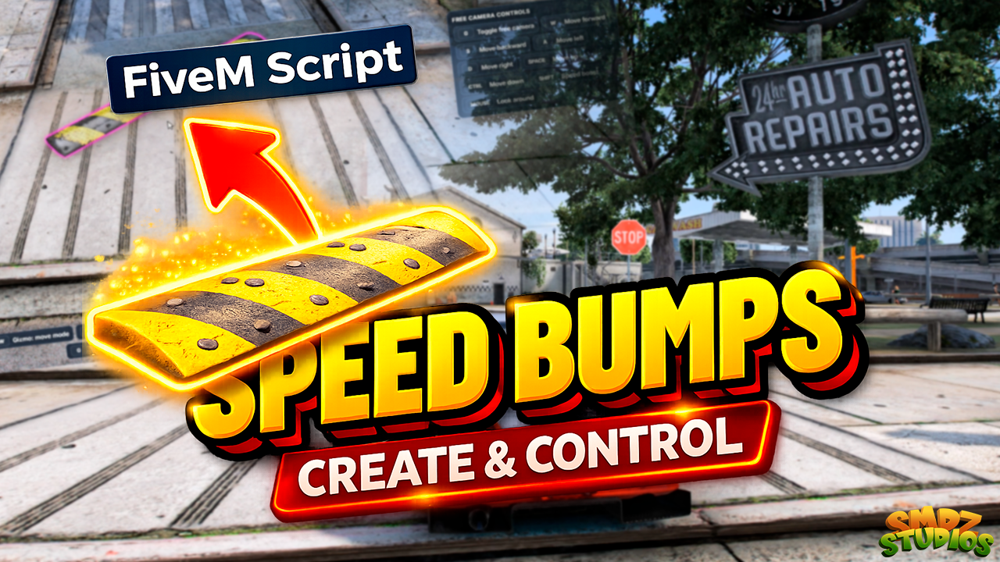
    

    

      <h3>Speed Bumps</h3>
      
SMDZ Speed Bumps is a traffic-control system for FiveM designed to make your city feel alive, organized, and professional.

      

        ESXQBCOREQBXOPEN SOURCE AVAILABLE
      

      

        <a class="home-showcase-btn home-showcase-btn--docs" href="/#/resources/paid/speed-bumpers.md">VIEW DOCS</a>
        <a class="home-showcase-btn home-showcase-btn--buy" href="https://smdz-studios.tebex.io/package/speed-bumps" target="_blank" rel="noopener noreferrer">BUY NOW</a>
      

    

  </article>

  <article class="home-showcase-card">
    

      
    

    

      <h3>Realistic UAV</h3>
      
UAV is a tactical UAV script with a synchronized physical aircraft, lockable aerial camera, SQL-backed cooldowns, and a modern overlay.

      

        ESXQBCOREQBXOPEN SOURCE AVAILABLE
      

      

        <a class="home-showcase-btn home-showcase-btn--docs" href="/#/resources/paid/realistic-uav.md">VIEW DOCS</a>
        <a class="home-showcase-btn home-showcase-btn--buy" href="https://smdz-studios.tebex.io/package/realistic-uav" target="_blank" rel="noopener noreferrer">BUY NOW</a>
      

    

  </article>

  <article class="home-showcase-card">
    

      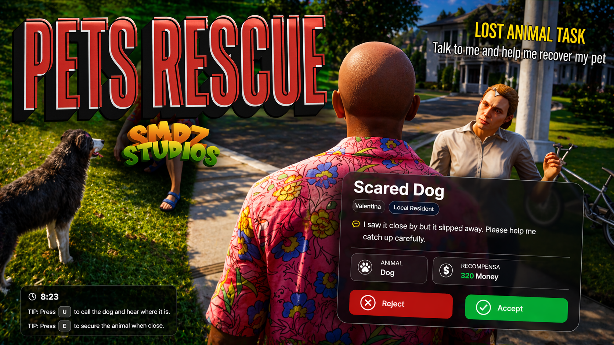
    

    

      <h3>Pets Rescue</h3>
      
A Mission system where players rescue lost pets for NPCs, searching dynamic areas and earning rewards. Enhances civilian roleplay and adds immersive, repeatable gameplay.

      

        ESXQBCOREQBX
      

      

        <a class="home-showcase-btn home-showcase-btn--docs" href="/#/resources/paid/pets-rescue.md">VIEW DOCS</a>
        <a class="home-showcase-btn home-showcase-btn--buy" href="https://smdz-studios.tebex.io/package/pets-rescue" target="_blank" rel="noopener noreferrer">BUY NOW</a>
      

    

  </article>

  <article class="home-showcase-card">
    

      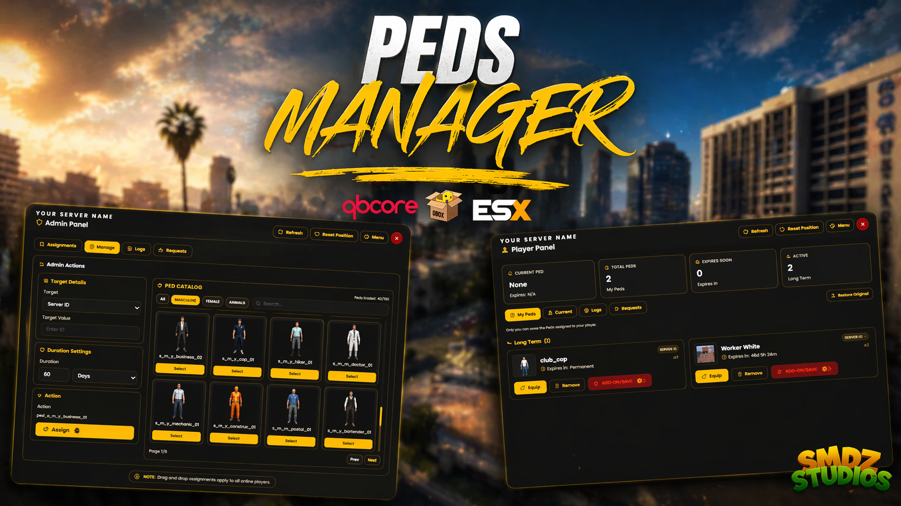
    

    

      <h3>Peds Manager</h3>
      
Advanced ped management system with admin tools, ped requests, and appearance restore.

      

        ESXQBCOREQBX
      

      

        <a class="home-showcase-btn home-showcase-btn--docs" href="/#/resources/paid/peds-manager.md">VIEW DOCS</a>
        <a class="home-showcase-btn home-showcase-btn--buy" href="https://smdz-studios.tebex.io/package/peds-manager" target="_blank" rel="noopener noreferrer">BUY NOW</a>
      

    

  </article>

  <article class="home-showcase-card">
    

      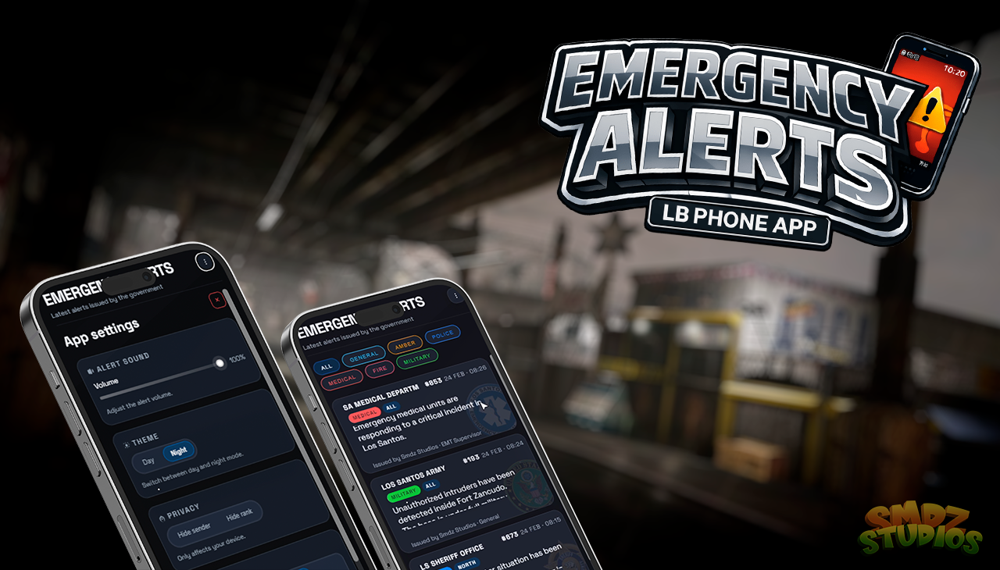
    

    

      <h3>App Emergency Alerts</h3>
      
In-app emergency notifications with clean dispatch flow and easy framework integration.

      

        ESXQBCOREQBXOPEN SOURCE AVAILABLE
      

      

        <a class="home-showcase-btn home-showcase-btn--docs" href="/#/resources/paid/app-emergency-alerts.md">VIEW DOCS</a>
        <a class="home-showcase-btn home-showcase-btn--buy" href="https://smdz-studios.tebex.io/package/emergency-alerts" target="_blank" rel="noopener noreferrer">BUY NOW</a>
      

    

  </article>

  <article class="home-showcase-card">
    

      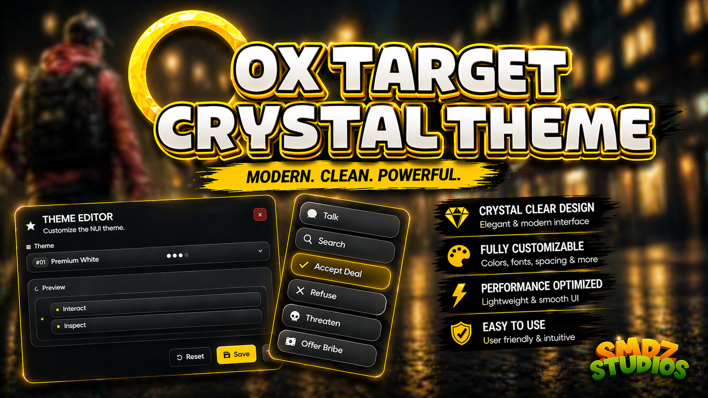
    

    

      <h3>OX Target Redesign Crystal</h3>
      
Crystal-styled redesign for ox_target interaction visuals with cleaner layout and readability.

      

        ESXQBCOREQBX
      

      

        <a class="home-showcase-btn home-showcase-btn--docs" href="/#/resources/redesings/ox-target-redesing-crystal.md">VIEW DOCS</a>
        <a class="home-showcase-btn home-showcase-btn--buy" href="https://smdz-studios.tebex.io/package/oxtarget-crystal-style" target="_blank" rel="noopener noreferrer">BUY NOW</a>
      

    

  </article>

  <article class="home-showcase-card">
    

      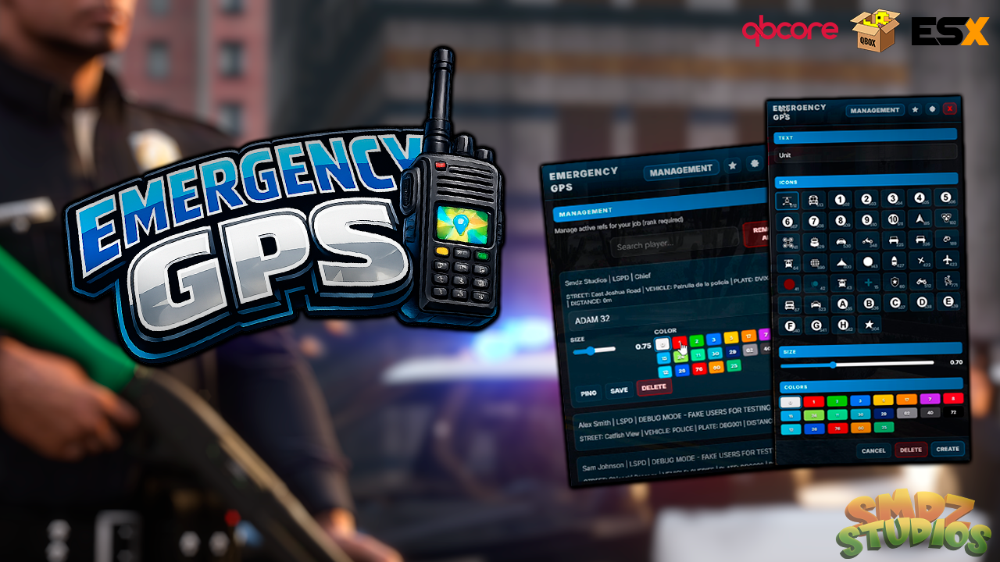
    

    

      <h3>Emergency GPS</h3>
      
Fast emergency location tracking for team coordination, response clarity and safer operations.

      

        ESXQBCORESTANDALONEOPEN SOURCE AVAILABLE
      

      

        <a class="home-showcase-btn home-showcase-btn--docs" href="/#/resources/paid/emergency-gps.md">VIEW DOCS</a>
        <a class="home-showcase-btn home-showcase-btn--buy" href="https://smdz-studios.tebex.io/package/emergency-gps" target="_blank" rel="noopener noreferrer">BUY NOW</a>
      

    

  </article>

  <article class="home-showcase-card">
    

      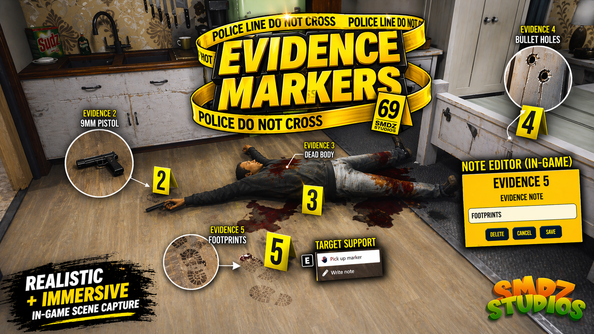
    

    

      <h3>Evidence Markers</h3>
      
Reliable evidence placement and scene visualization with practical controls for RP workflows.

      

        ESXQBCORESTANDALONEOPEN SOURCE AVAILABLE
      

      

        <a class="home-showcase-btn home-showcase-btn--docs" href="/#/resources/paid/evidence-markers.md">VIEW DOCS</a>
        <a class="home-showcase-btn home-showcase-btn--buy" href="https://smdz-studios.tebex.io/package/evidence-markers" target="_blank" rel="noopener noreferrer">BUY NOW</a>
      

    

  </article>

  <article class="home-showcase-card">
    

      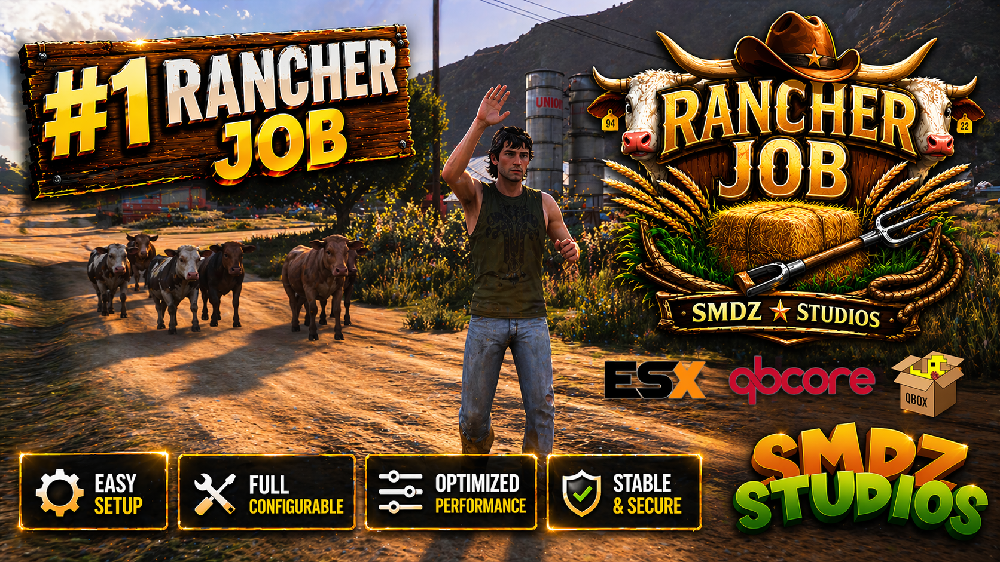
    

    

      <h3>Rancher Job</h3>
      
Ranch workflow with configurable tasks and progression to expand farming roleplay scenarios.

      

        ESXQBCORESTANDALONEOPEN SOURCE AVAILABLE
      

      

        <a class="home-showcase-btn home-showcase-btn--docs" href="/#/resources/paid/rancher-job.md">VIEW DOCS</a>
        <a class="home-showcase-btn home-showcase-btn--buy" href="https://smdz-studios.tebex.io/package/the-rancher-job" target="_blank" rel="noopener noreferrer">BUY NOW</a>
      

    

  </article>

  <article class="home-showcase-card">
    

      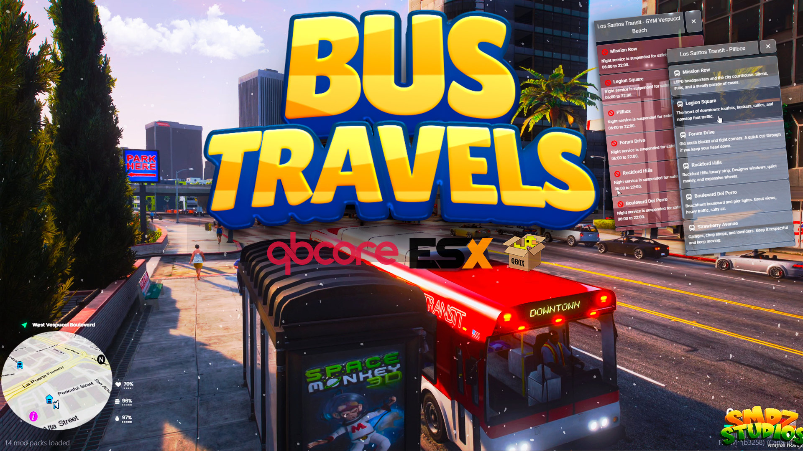
    

    

      <h3>Bus Travel</h3>
      
Route-based travel system for immersive city transport with configurable stops and prices.

      

        ESXQBCORESTANDALONEOPEN SOURCE AVAILABLE
      

      

        <a class="home-showcase-btn home-showcase-btn--docs" href="/#/resources/paid/bus-travel.md">VIEW DOCS</a>
        <a class="home-showcase-btn home-showcase-btn--buy" href="https://smdz-studios.tebex.io/package/bus-travels" target="_blank" rel="noopener noreferrer">BUY NOW</a>
      

    

  </article>

  <article class="home-showcase-card">
    

      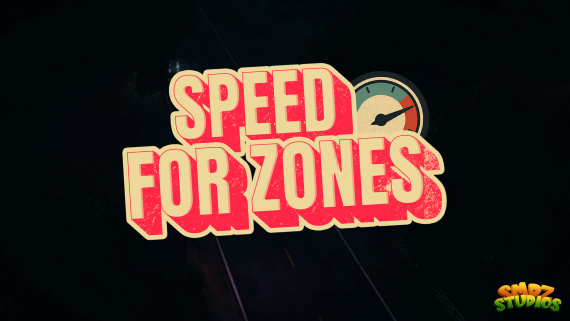
    

    

      <h3>Speed For Zones</h3>
      
Speed zones is a zones-based speed limits using PolyZone polygons.

      

        ESXQBCOREOPEN SOURCE AVAILABLE
      

      

        <a class="home-showcase-btn home-showcase-btn--docs" href="/#/resources/paid/speed-for-zones.md">VIEW DOCS</a>
        <a class="home-showcase-btn home-showcase-btn--buy" href="https://smdz-studios.tebex.io/package/speed-for-zones" target="_blank" rel="noopener noreferrer">BUY NOW</a>
      

    

  </article>

  <article class="home-showcase-card">
    

      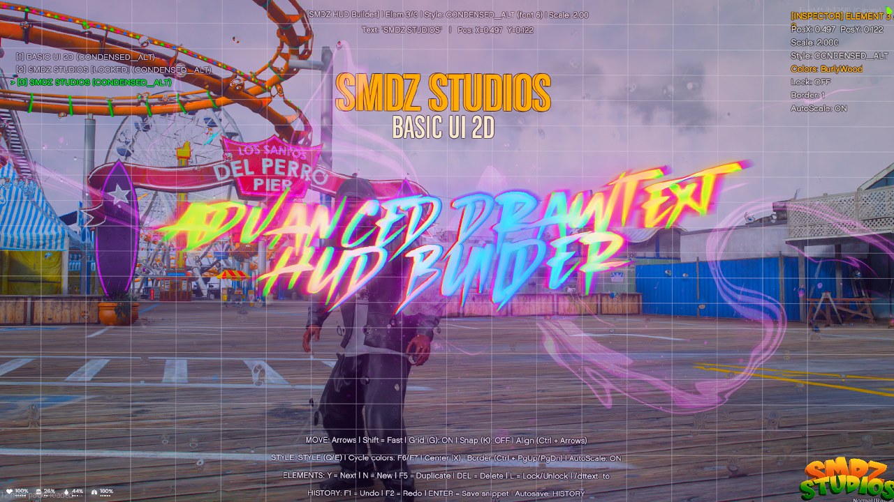
    

    

      <h3>HUD2D Builder</h3>
      
Build and tune HUD elements quickly with modular options for custom server interfaces.

      

        ESXQBCORESTANDALONEOPEN SOURCE AVAILABLE
      

      

        <a class="home-showcase-btn home-showcase-btn--docs" href="/#/resources/paid/hud2d-builder.md">VIEW DOCS</a>
        <a class="home-showcase-btn home-showcase-btn--buy" href="https://smdz-studios.tebex.io/package/drawtext-hud" target="_blank" rel="noopener noreferrer">BUY NOW</a>
      

    

  </article>

  <article class="home-showcase-card">
    

      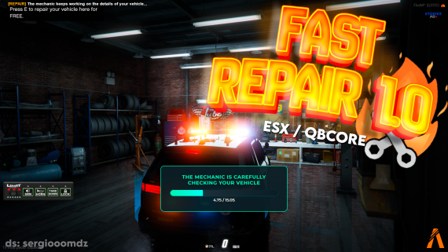
    

    

      <h3>Fast Repair 1.0</h3>
      
Lightweight repair logic designed for smoother vehicle maintenance and roleplay consistency.

      

        ESXQBCORESTANDALONE
      

      

        <a class="home-showcase-btn home-showcase-btn--docs" href="/#/resources/paid/fast-repair.md">VIEW DOCS</a>
        <a class="home-showcase-btn home-showcase-btn--buy" href="https://smdz-studios.tebex.io/package/fast-repair" target="_blank" rel="noopener noreferrer">BUY NOW</a>
      

    

  </article>

---

# 🧭 **WHAT YOU WILL FIND IN THESE DOCS:**

Think of this documentation as a focused hub for **server owners** and **developers** using SMDZ Studios scripts:

  

    <h3>🏠 Home</h3>
    

      A clean entry point with links to the most important areas:
      scripts list, support, FAQ and troubleshooting.
    

  

  

    <h3>📚 Script pages</h3>
    

      Each script has its own page covering:
      requirements, installation, configuration, usage, developer events and exports.
    

  

  

    <h3>🆘 Support & Troubleshooting</h3>
    

      Dedicated sections for common problems, Asset Escrow explanations,
      performance tips and how to open an effective support ticket.
    

  

---

# 📬 **WHERE TO GO NEXT:**

Depending on what you need right now:

- 🧩 **You have a problem/error**
  → Go to **[Common Problems](problems.md)** for step‑by‑step diagnostics.

- 🧾 **You want to understand Asset Escrow / entitlements**
  → Read **[Asset Escrow System](fxap.md)** to understand how Cfx.re / Tebex protection works and how to fix typical entitlement issues.

- 🆘 **You need direct help**
  → Visit **[Support](support.md)** for contact details and what to include in your ticket so it can be handled quickly and professionally.

Use the **search bar** in the sidebar whenever you remember a keyword but not the exact page name.
Everything here is designed to save you time and reduce guesswork when running your FiveM server with SMDZ Studios scripts. 💚
